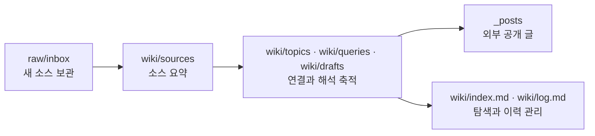

Andrej Karpathy가 2026년 4월 4일 공개한 `llm-wiki`는 새로운 앱 소개보다, 지식을 어떻게 오래 남길지에 대한 운영 문서에 가깝습니다.<a href="#src-1">[1]</a> 이 문서를 읽으며 가장 먼저 눈에 들어온 건 검색 정확도가 아니라 지식의 체류 시간이었어요. 기술 블로그를 오래 굴리다 보면 병목은 초안 생성보다 "전에 이미 읽었던 맥락을 다시 모으는 일"에서 생기는데, `llm-wiki`는 바로 그 비용을 줄이려는 제안처럼 읽혔습니다. 이 글에서는 그 철학을 먼저 짚고, 이 저장소의 `raw`, `wiki`, `_posts`, `AGENTS.md`에 어떻게 번역했는지 정리해보려 해요.

**이번 글에서 볼 것**

- `llm-wiki`의 핵심은 RAG를 대체하는 검색기가 아니라, **raw와 공개 글 사이에 지속적으로 갱신되는 wiki를 두는 운영 패턴**이라는 점이에요.
- 이 저장소에서는 그 패턴을 `raw/` 보관층, `wiki/` 작업층, `_posts/` 공개층, `AGENTS.md` 규칙층으로 나눠 옮겼어요.
- 중요한 효과는 첫 글을 빨리 쓰는 것이 아니라, 다음 글을 쓸 때 맥락 복구 비용이 줄어든다는 데 있습니다.

## 먼저 구조를 한 장으로 보면 이렇습니다

이 글에서 중요한 건 디렉터리 이름보다, 원문과 해석과 공개 결과를 서로 다른 층에 둬서 판단 이력이 사라지지 않게 만드는 흐름이에요.

Karpathy의 원문도 본질적으로는 이 구조를 말합니다. `raw sources`, `wiki`, `schema`를 분리해 두면 LLM은 질문 시점에 조각을 끌어오는 역할보다, 이미 읽은 내용을 계속 유지보수하는 역할에 더 가까워져요.<a href="#src-1">[1]</a> 블로그에 그대로 옮기면 "게시글을 쓴다"보다 "게시글이 나올 때까지의 사고를 남긴다"가 더 중요한 과제가 됩니다.

## RAG보다 먼저 묻는 건 지식이 어디에 남는가예요

**문제는 답변 한 번의 정확도보다, 이미 읽은 맥락이 다음 글에도 남아 있느냐예요.**

문서 기반 LLM 활용은 쉽게 RAG 형태로 흘러갑니다. 파일을 올려두고 질문하면 관련 조각을 그때 찾아 답을 합성하는 방식이죠. 이 구조는 빠른 응답에는 강하지만, 여러 문서를 함께 읽어야 보이는 해석은 질문할 때마다 다시 조립해야 합니다. 원문이 persistent wiki를 강조하는 이유도 여기에 있어요.<a href="#src-1">[1]</a>

기술 블로그도 비슷합니다. 예전에 읽은 글, 이전 게시글, 실험 메모, 비교 메모가 서로 떨어져 있으면 새 글은 매번 처음 조사하는 글처럼 시작돼요. `_posts/`만 쌓이는 구조는 결과물은 남기지만, 그 결과를 만든 판단의 축적은 남기기 어렵습니다.

| 운영 방식 | 질문 또는 집필 시점에 하는 일 | 남는 것 | 다음 글에서 생기는 비용 |
| --- | --- | --- | --- |
| `_posts/`만 쌓이는 블로그 | 필요한 맥락을 다시 찾고 다시 요약해요 | 공개 글 | 조사 맥락을 다시 복구해야 해요 |
| `raw -> wiki -> _posts` 구조 | 먼저 위키에서 관련 해석과 연결을 찾고 갱신해요 | 공개 글 + 중간 판단 + 비교 메모 | 이미 정리한 논지를 다시 쓰기 쉬워져요 |

이 비교에서 중요한 건 도구 이름이 아닙니다. 지식이 질문 시점에만 계산되는가, 아니면 중간층에 머무르는가의 차이예요. `llm-wiki`는 이 두 번째 방식을 고르자는 제안에 더 가깝습니다.

## llm-wiki는 검색기보다 유지보수 루틴에 가까워요

**원문이 강조하는 건 더 영리한 검색이 아니라, LLM에게 어떤 유지보수 일을 맡길 것인가예요.**

Karpathy는 새 소스가 들어오면 wiki 페이지를 만들고, 관련 개념을 연결하고, 충돌하는 주장을 표시하고, 질문 응답도 파일링하자는 식으로 설명합니다.<a href="#src-1">[1]</a> 그래서 이 문서는 기능 목록보다 운영 루틴 문서처럼 읽힙니다.

**이 패턴에서 사람과 LLM의 역할**

- 사람은 소스를 고르고, 무엇을 더 깊게 읽을지 판단하고, 공개 글로 승격할지 결정해요.
- LLM은 요약 페이지 작성, 관련 문서 연결, 이전 해석 갱신, 로그 정리 같은 유지보수를 맡아요.

원문에 Obsidian이나 그래프 뷰 예시가 나오긴 하지만, 그건 구현 예시일 뿐이에요. 핵심은 특정 툴이 아니라 "지식을 다시 조립하지 않게 만드는 루틴"입니다. 블로그 운영으로 옮기면, 글쓰기 자동화보다 위키 유지보수 자동화가 먼저 와야 한다는 뜻으로 읽힙니다.

## 이 저장소에서는 raw, wiki, _posts를 서로 다른 층으로 둬요

**이 저장소에서 가장 크게 바뀐 건 디렉터리 구조보다 책임 분리예요.**

`raw/`는 원문을 보관하는 층이에요. `raw/inbox/`에 새 자료를 두고, 정리되면 `raw/sources/`와 `raw/assets/`로 옮깁니다. 이 층에서는 해석을 덮어쓰지 않아요. 나중에 판단이 틀렸을 때 되돌아갈 기준점이 여기 있어야 하기 때문입니다.

`wiki/`는 LLM이 실제로 작업하는 층입니다. `wiki/sources/`는 소스 요약, `wiki/topics/`는 개념과 주장 연결, `wiki/queries/`는 재사용할 답변, `wiki/drafts/`는 발행 후보 초안을 맡아요. 여기서는 "무엇을 알게 되었는가"뿐 아니라 "어떤 페이지와 연결되는가"도 같이 남깁니다.

`_posts/`는 외부 독자에게 공개하는 최종 결과만 맡습니다. 그리고 `AGENTS.md`는 원문의 schema 역할을 받아 ingest, query, lint, publish 순서를 고정해요. 결국 이 구조는 예쁜 분류가 아니라, 원문과 해석과 공개 결과가 어느 층에서 바뀌었는지 다시 추적할 수 있게 만드는 장치입니다.

## 질문 답변까지 위키에 남겨야 다음 글이 쉬워져요

**블로그 운영에서 위키의 진짜 효용은 초안보다 질의응답 축적에서 더 크게 드러나요.**

원문은 질문에 대한 좋은 답도 채팅에서 끝내지 말고 wiki에 파일링하자고 말합니다.<a href="#src-1">[1]</a> 이 저장소에서도 그 부분을 `wiki/queries/`로 옮겼어요. 예를 들어 MathJax 설정 같은 답변은 채팅 한 번으로 끝낼 수 있지만, 나중에 수식 글을 또 쓸 때 다시 필요해질 가능성이 큽니다. 그래서 질의응답 자체를 재사용 가능한 문서로 남기는 편이 낫습니다.

같은 이유로 `wiki/index.md`와 `wiki/log.md`도 중요해집니다. `index.md`는 지금 어떤 자산이 있는지 빠르게 찾게 해 주고, `log.md`는 최근에 무엇을 ingest 했고 어떤 글을 수정했는지를 시간순으로 남겨요. 검색창 하나로는 찾기 어려운 "최근 판단의 맥락"을 이 두 파일이 보강합니다.

## 먼저 고정해야 하는 건 거대한 도구가 아니라 순서예요

**이 패턴은 대형 인프라보다 작은 운영 순서를 먼저 고정할 때 힘이 납니다.**

이 저장소 기준으로는 아래 다섯 단계가 핵심이에요.

1. 새 자료는 먼저 `raw/inbox/`에 넣어 원문을 보존해요.
2. 읽은 뒤 `wiki/sources/`에 소스 요약과 블로그 포인트를 남겨요.
3. 관련 개념은 `wiki/topics/`에서 연결하고, 발행 후보는 `wiki/drafts/`에서 키워요.
4. 재사용 가치가 있는 답변과 비교 메모는 `wiki/queries/`에 파일링해요.
5. 마지막에 `wiki/index.md`와 `wiki/log.md`를 갱신하고, 공개 가치가 확인된 글만 `_posts/`로 올려요.

이 순서를 지키면 새 글을 쓸 때마다 자료를 처음부터 다시 모으지 않아도 됩니다. 검색 도구나 임베딩 인프라는 그다음 문제예요. 원문도 작은 규모에서는 `index.md`만으로도 충분히 버틸 수 있다고 보는데, 지금 이 블로그에도 먼저 필요한 건 더 큰 검색 스택보다 꾸준히 갱신되는 위키 습관에 가까워 보입니다.<a href="#src-1">[1]</a>

## 마무리

`llm-wiki`에서 제가 가장 크게 가져온 건 Obsidian이나 특정 툴이 아니라, LLM에게 유지보수를 맡기고 사람은 소싱과 판단에 집중하라는 철학이에요. 기술 블로그를 `_posts/` 목록으로만 운영하면 게시글은 늘어도 조사 맥락은 잘 남지 않습니다. 반대로 `raw -> wiki -> _posts` 흐름이 굳어지면, 글 한 편을 더 빨리 쓰는 것보다 다음 글이 덜 힘들어지는 구조를 먼저 만들 수 있어요.

## 출처

[1] Andrej Karpathy, LLM Wiki, <a href="https://gist.github.com/karpathy/442a6bf555914893e9891c11519de94f" target="_blank" rel="noopener noreferrer">[원문보기]</a>
