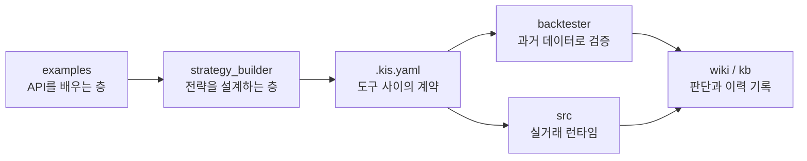

`open-trading-api`를 보며 제가 새로 배운 건 자동매매 봇의 난이도가 전략 공식 안에만 있지 않다는 점이었어요.<a href="#src-1">[1]</a> 처음에는 한국투자증권 Open API를 어떻게 호출하고, 어떤 조건에서 매수 신호를 만들지에 관심이 갔습니다. 그런데 위키에 소스 요약을 만들고 구조를 다시 읽어 보니, 더 오래 남는 질문은 따로 있었어요. 예제와 실거래를 어디서 나눌 것인가, 전략 설계와 백테스트는 어떤 계약으로 연결할 것인가, 그리고 실패한 운영 판단은 다음 구현에서 어떻게 다시 읽히게 할 것인가였죠.

**이번 글에서 볼 것**

- `open-trading-api` 개발에서 가장 크게 배운 점은 **더 많은 전략을 넣는 법이 아니라, 서로 다른 층의 책임을 섞지 않는 법**이었어요.
- `.kis.yaml`, `strategy_builder`, `backtester`, `src`, `wiki`는 각각 다른 문제를 풀고, 그 사이에는 명시적인 계약과 기록이 필요했어요.
- 이 글은 주문 로직 설명보다, 이 개발이 제게 남긴 설계 감각과 위키 기반 회고 방식을 정리합니다.

## 작업공간은 경계를 드러낼 때 쓸모 있어요

`open-trading-api`를 하나의 자동매매 봇이라고만 부르면 중요한 부분이 빠집니다. 위키의 소스 요약은 이 저장소를 학습용 API 예제, 전략 설계 UI, 백테스트 엔진, 실거래 런타임, 지식 위키가 연결된 작업공간으로 정리해 두고 있어요. 이 표현이 마음에 들었던 이유는, 저장소가 커졌다는 사실보다 각 층이 서로 다른 질문을 맡는다는 점을 먼저 보여 주기 때문입니다.

학습용 예제는 API 호출 방법을 이해시키고, `strategy_builder`는 사람이 전략을 구성하게 해 줍니다. `backtester`는 그 전략이 과거 데이터에서 어떤 모양으로 움직이는지 확인하고, `src`는 실거래 런타임에서 주문과 복구를 다룹니다. 여기에 `wiki`와 `kb`가 붙으면, 구현 중 생긴 판단이 채팅이나 커밋 메시지 바깥으로 흩어지지 않고 다시 읽을 수 있는 문서가 됩니다.

이 구조에서 제가 배운 건 "모든 것을 한 번에 실행 가능한 코드로 합치자"가 아니었어요. 오히려 반대에 가깝습니다. 자동매매 시스템에서는 예제, 설계, 검증, 운영, 회고가 같은 언어를 공유하되 같은 책임을 지면 안 됩니다. 예제가 실거래 안전성을 보장하지 않고, 백테스트가 주문 체결을 보장하지 않으며, 위키가 코드의 동작을 대신하지 않는다는 경계를 분명히 하는 일이 먼저였습니다.

이 개발에서 중요했던 건 각 도구의 개수가 아니라, 전략 아이디어가 어떤 계약을 거쳐 검증과 운영으로 이동하는지 볼 수 있게 만드는 흐름이었어요.

## 공통 계약은 번역 비용을 줄였어요

`strategy_builder`와 `backtester` 사이의 `.kis.yaml`은 이 저장소에서 가장 실용적인 배움 중 하나였습니다. 전략을 화면에서 만들고, 다시 검증 엔진이 읽게 하려면 둘 사이에 중간 표현이 필요합니다. 이 파일은 전략 설계 UI와 백테스터가 서로의 내부 구현을 몰라도 같은 전략을 주고받게 해 주는 계약에 가까웠어요.

다만 여기서 배운 점은 "공통 포맷 하나면 전부 해결된다"가 아니었습니다. 위키의 열린 질문에도 남아 있듯이, `.kis.yaml`이 장기적으로 실거래 런타임까지 포괄하는 단일 전략 계약이 될 수 있는지는 아직 더 봐야 합니다. 백테스트에서 편한 표현과 실거래에서 필요한 표현은 다를 수 있어요. 실거래 쪽은 주문 가능 시간, 계좌 상태, 미체결 주문, 재기동 복구처럼 과거 데이터 검증만으로는 드러나지 않는 조건을 함께 다뤄야 하니까요.

그래서 이 개발은 저에게 계약의 장점과 한계를 같이 가르쳐 줬습니다. 계약이 있으면 도구 사이의 번역 비용이 줄어듭니다. 하지만 계약이 넓어질수록 "무엇을 표현하지 않을 것인가"도 같이 정해야 해요. 전략 설정 파일이 주문 안전성까지 모두 담으려고 하면 오히려 책임이 흐려지고, 실거래 런타임이 가져야 할 판단까지 설정 파일에 밀어 넣게 됩니다.

## 구현보다 먼저 물어야 할 질문이 있었어요

자동매매 코드를 만들 때는 "어떤 전략이 수익을 내는가"라는 질문이 가장 먼저 떠오릅니다. 그런데 이 저장소를 위키 관점으로 정리하면서, 그보다 앞에 놓아야 할 질문이 있다는 걸 배웠어요. 이 코드는 지금 어떤 환경을 가정하는가, 어디까지가 데모이고 어디부터가 운영인가, 실패했을 때 어떤 상태를 신뢰할 수 있는가 같은 질문입니다.

예를 들어 위키는 `strategy_builder`와 `backtester`가 여러 프리셋 전략을 전면에 두더라도, 실거래 런타임에 실제 등록된 전략과는 경계가 다를 수 있다고 정리합니다. 이 차이는 사소한 문서 디테일이 아니에요. 독자가 저장소를 볼 때 "많이 준비된 전략 목록"과 "현재 운영 코드가 감당하는 전략 목록"을 혼동하면, 구현 상태를 실제보다 더 완성된 것처럼 읽게 됩니다.

이 배움은 블로그 글에도 그대로 이어졌습니다. 개발 회고를 쓸 때 기능을 많이 나열하면 그럴듯해 보이지만, 정작 독자가 확인해야 할 지점은 "무엇이 이미 운영 경로에 들어왔고, 무엇은 아직 설계나 검증 단계에 머무르는가"입니다. 자동매매처럼 돈과 연결되는 코드는 특히 그렇습니다. 멋진 전략 이름보다 현재 코드가 책임지는 범위를 먼저 말하는 편이 더 정직합니다.

| 구분 | 먼저 확인해야 할 질문 | 제가 배운 점 |
| --- | --- | --- |
| 예제 코드 | API 호출을 이해시키는가 | 예제는 운영 안전성을 대신하지 않아요 |
| 전략 설계 | 사람이 의도를 표현할 수 있는가 | UI의 풍부함과 실거래 준비도는 별개예요 |
| 백테스트 | 과거 데이터에서 재현 가능한가 | 검증 결과는 주문 체결 조건을 포함하지 않아요 |
| 실거래 런타임 | 지금 주문해도 되는 상태인가 | 신호보다 상태와 차단 조건이 먼저예요 |
| 위키와 로그 | 판단이 다음 구현에 남는가 | 기억에 맡긴 회고는 반복 개발에서 사라져요 |

## 위키는 기억보다 판단을 남겼어요

이 프로젝트를 블로그 위키에 흡수하면서 가장 좋았던 점은, 개발 사실보다 판단의 이유가 남기 쉬워졌다는 점입니다. `wiki/sources/open-trading-api.md`는 저장소를 한 번 요약하고 끝내는 문서가 아니라, 블로그에서 어떤 관점으로 다뤄야 하는지도 같이 적어 둡니다. `wiki/topics/llm-friendly-trading-stack.md`는 그 관점을 더 일반화해서, LLM이 읽기 쉬운 자동매매 작업공간이라는 주제로 묶어 줍니다.

이 둘을 함께 읽으면 글의 무게중심이 달라져요. 단순히 "이 저장소에는 이런 폴더가 있다"가 아니라, "왜 이런 폴더들이 한 저장소 안에 같이 있어야 했는가"를 묻게 됩니다. `wiki/log.md`도 비슷한 역할을 합니다. 언제 어떤 소스를 읽었고, 어떤 글을 발행했으며, 어떤 작성 규칙이 추가됐는지를 시간순으로 남기니 이전 판단을 다시 찾기 쉬워집니다.

저는 이 방식이 자동매매 개발과 잘 맞는다고 느꼈습니다. 자동매매에서는 오늘의 버그가 내일의 정책이 되는 경우가 많아요. 주문을 막은 이유, 복구를 보수적으로 둔 이유, 백테스트와 실거래를 분리한 이유를 파일로 남기지 않으면, 다음 수정 때 같은 질문을 다시 시작하게 됩니다. 위키는 똑똑한 검색창이라기보다, 그런 판단을 계속 누적하는 작업대에 가까웠어요.

**이번 개발에서 위키가 맡은 역할**

- `wiki/sources`는 외부 저장소와 로컬 구현을 블로그 관점으로 다시 요약했어요.
- `wiki/topics`는 한 번의 구현 경험을 "LLM 친화형 자동매매 작업공간"이라는 재사용 가능한 주제로 바꿨어요.
- `wiki/log`는 글과 규칙이 언제 바뀌었는지 남겨, 다음 재작성의 기준점을 만들어 줬어요.

## LLM 친화성은 다시 읽힘에서 나왔어요

`LLM 친화형`이라는 말을 처음 들으면 코드를 더 잘 생성하게 만드는 설정처럼 들릴 수 있습니다. 하지만 이 개발에서 제가 배운 LLM 친화성은 생성 속도보다 다시 읽히는 구조에 가까웠어요. 폴더 이름, 설정 파일, 문서, 위키가 안정적으로 연결돼 있어야 LLM도 사람도 같은 맥락으로 돌아올 수 있습니다.

`examples_llm`과 `examples_user`를 나누는 방식도 그런 관점에서 볼 수 있어요. LLM이 단일 기능을 탐색하기 쉬운 예제와, 사람이 실제 사용 흐름을 따라가기 쉬운 예제는 목적이 다릅니다. `SPEC_v0.1.md`나 `AGENTS.md` 같은 문서도 마찬가지입니다. 단순한 설명 문서가 아니라, 다음 구현자가 어떤 용어와 경계를 따라야 하는지 알려 주는 표지판에 가깝습니다.

결국 LLM 친화적인 저장소는 "AI가 알아서 해 주는 저장소"가 아니었습니다. 오히려 사람이 판단한 경계를 더 명시적으로 적어 둔 저장소였어요. 시장코드와 주문용 거래소 코드를 섞지 않는 규칙, 설계 단계와 운영 단계를 구분하는 문서, 외부 소스와 내부 해석을 나누는 위키 구조가 쌓일수록 다음 작업의 시작 비용이 줄어듭니다.

## 다음 과제는 경계의 수렴이에요

이번 개발에서 배운 것을 한 문장으로 줄이면, 자동매매 시스템은 전략을 추가할수록 경계 관리가 더 중요해진다는 것입니다. 전략 설계와 백테스트를 연결하는 계약은 필요하지만, 그 계약이 실거래 상태까지 어디까지 가져갈지는 더 신중하게 정해야 합니다. 위키의 열린 질문처럼 `.kis.yaml`이 실거래 런타임까지 확장될 수 있는지, 백테스트 프리셋과 운영 전략 목록을 어떤 정책으로 맞출지, 운영 상태를 문서에 얼마나 자동 반영할지도 아직 남아 있어요.

그래도 이전보다 분명해진 기준은 있습니다. 좋은 자동매매 개발 회고는 수익률 공식이나 전략 이름을 많이 적는 글이 아니라, 어떤 책임을 어디에 두었고 어떤 판단을 다음 구현에 남겼는지 보여 주는 글이어야 합니다. 저는 `open-trading-api`를 통해 그 기준을 조금 더 구체적으로 배웠습니다. 다음에 이 저장소를 다시 읽을 때도 먼저 볼 곳은 새 전략 목록이 아니라, 계약과 위키와 로그가 서로 얼마나 덜 어긋나고 있는지일 것 같아요.

## 출처

[1] GitHub, koreainvestment/open-trading-api, <a href="https://github.com/koreainvestment/open-trading-api" target="_blank" rel="noopener noreferrer">[원문보기]</a>
