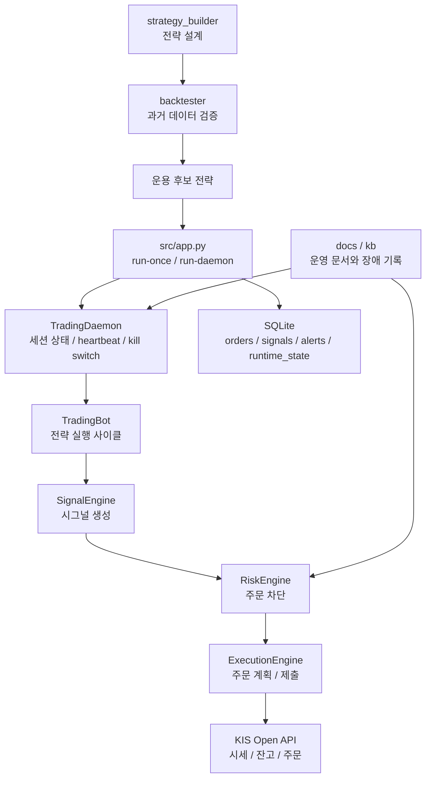

실시간 자동매매를 직접 구현해보면서 확인하고 싶었던 것은 "어떤 전략이 더 잘 맞는가"보다 "이 시스템이 실제 운영 중에 얼마나 버틸 수 있는가"였습니다. 차트 위에서는 그럴듯해 보이는 진입·청산 규칙도, 실시간 환경에 올라가면 세션 판별, stale quote 차단, 재기동 복구, 중복 주문 방지, 토큰 갱신 실패 같은 문제 앞에서 쉽게 흔들립니다.

[`open-trading-api`](https://github.com/koreainvestment/open-trading-api)를 읽으며 가장 강하게 남은 인상도 바로 그 지점이었습니다. 이 저장소는 단순한 KIS Open API 샘플 코드 모음이 아니라, 전략을 만들고 검증하고 운영하고 장애를 기록하는 전체 작업공간에 가깝습니다. 그래서 이 글도 전략 자랑보다 운영 설계 회고에 초점을 맞추려고 합니다.

## 왜 이 프로젝트를 만들었는가

실시간 자동매매를 구현해 보면 금방 체감하는 사실이 있습니다. 전략은 몇 줄의 규칙으로 설명할 수 있지만, 운영은 그렇지 않다는 점입니다. 장이 열렸다는 판정과 지금 주문을 내도 된다는 판단은 다를 수 있고, API가 잠깐 실패했을 때 몇 번까지 재시도할지, 재기동 직후 남아 있는 주문 상태를 어떻게 해석할지도 별도로 정해야 합니다.

저는 이 프로젝트를 통해 그 차이를 직접 확인하고 싶었습니다. "좋은 전략"을 만들기보다 "망가지지 않는 주문 루프"를 만드는 일이 실제로 얼마나 더 어려운지, 그리고 그 난도가 코드에서 어떤 형태로 드러나는지를 보고 싶었습니다.

## 프로젝트 한눈에 보기

이 저장소는 크게 네 계층으로 읽는 편이 이해하기 쉽습니다.

- `src/`: 실거래 봇 런타임
- `strategy_builder/`: 전략 설계와 시그널 생성 UI
- `backtester/`: 과거 데이터 기반 전략 검증
- `docs/`, `kb/`: 운영 문서, 장애 분석, 위키 기록

여기에 `strategy_builder`와 `backtester`는 `.kis.yaml`이라는 공통 포맷으로 연결됩니다. 즉 전략 아이디어를 UI에서 만들고, 같은 전략 정의를 과거 데이터로 검증하고, 그 뒤 실제 운영 후보로 가져오는 흐름이 한 저장소 안에 묶여 있습니다.

## 전체 아키텍처

실거래 경로만 좁혀 보면 구조는 비교적 명확합니다. KIS Open API를 직접 호출하는 broker adapter가 있고, 그 위에서 `TradingBot`이 단일 실행 사이클을 오케스트레이션합니다. 그 안에서 전략 레지스트리, 시그널 엔진, 리스크 엔진, 실행 엔진, 포트폴리오 서비스, 복구 서비스가 각각 역할을 나눠 가집니다.

중요한 점은 전략과 운영 제어면이 분리돼 있다는 것입니다. 전략은 "언제 사고팔지"를 말하고, 운영 계층은 "지금 이 주문을 정말 내도 되는지"를 따로 판단합니다. 이 분리가 없으면 전략 코드가 곧 운영 코드가 되고, 예외 케이스가 늘어날수록 시스템은 빠르게 불안정해집니다.

## 실시간 트레이딩 봇은 어떻게 돌아가는가

이 프로젝트를 읽을 때 가장 먼저 봐야 할 분기점은 `run-once`와 `run-daemon`입니다. `run-once`는 계좌 조회, 시세 조회, 시그널 생성, 리스크 검사, 주문 제출을 한 번만 수행하는 단일 실행 경로입니다. 반면 `run-daemon`은 여기에 세션 인식과 운영 루프를 얹습니다.

`TradingDaemon`은 시장 상태를 `PREOPEN`, `NORMAL`, `AFTER_HOURS`, `CLOSED`로 판별하고, 주기적으로 heartbeat를 남기며, 토큰 만료가 임박하면 선제 갱신을 시도합니다. 시작 시점에는 startup reconciliation으로 브로커 잔고, 미체결 주문, 로컬 DB 주문을 대조합니다. 문제가 남아 있으면 `startup_blocked`로 시작 자체를 막고, 반복 실패가 누적되면 kill switch 파일을 생성해 신규 주문 루프를 멈춥니다.

이 구조를 보고 나면 "프로세스가 살아 있는 것"과 "주문이 가능한 것"이 전혀 같은 뜻이 아니라는 점이 분명해집니다. 실제 운영에서는 이 차이를 명시적으로 코드로 분리해 두는 것이 꽤 중요합니다.

## 매수/매도 전략 설계

현재 `src/` 실거래 봇에 실제로 등록된 전략은 세 가지입니다. `sma_cross_5m`, `rsi_mean_reversion_d1`, `opening_range_breakout_1m`입니다. 각각 5분봉 추세추종, 일봉 평균회귀, 장초반 돌파라는 서로 다른 시간축과 성격을 대표합니다.

이 세 전략을 흥미롭게 만드는 것은 수익률보다 운영 관찰 포인트가 다르다는 점입니다. 분봉 전략은 bar 집계와 warmup이 중요하고, 일봉 전략은 장중에 미완성 일봉을 어떻게 다룰지가 중요합니다. ORB는 장초반 아이디어 자체보다, 장 시작 이후 세션 전체 맥락을 복원하는 데이터 적재 방식이 더 중요해집니다.

## 전략별 특징과 실제 운용 관점의 차이

문서를 따라가다 보면 백테스트에서 좋아 보이는 전략과 실시간 봇 안에서 안정적으로 도는 전략이 다르다는 점이 자주 드러납니다. 예를 들어 `sma_cross_5m`는 진입과 청산이 모두 구현돼 있어 현재 가장 완성도가 높은 전략으로 읽힙니다. 반면 `rsi_mean_reversion_d1`는 실시간 봇 안에 있어도 실제 성격은 장중 단타보다 일봉 스윙에 가깝습니다.

`opening_range_breakout_1m`는 장초반 모멘텀 포착이라는 아이디어는 분명하지만, 세션 전체 1분봉을 다시 재생해야 하고 청산 로직은 아직 상대적으로 미완입니다. 이런 차이를 보면 전략의 "논리적 매력"과 "운영 적합성"은 별개라는 사실을 다시 확인하게 됩니다.

여기서 하나 더 조심할 점은 `strategy_builder`와 `backtester`가 10개 프리셋 전략을 보여 준다는 사실과, 실제 `src/` 실거래 봇에 등록된 전략이 3개라는 사실을 섞지 않는 것입니다. 확장 방향과 현재 운영 범위는 분리해서 읽는 편이 정확합니다.

## 리스크 관리와 주문 차단 로직

이 봇에서 전략만큼 중요한 것은 주문을 막는 로직입니다. 실제 차단 사유는 꽤 현실적입니다. 시장 상태가 `NORMAL`이 아니면 주문하지 않고, quote가 stale 상태면 막고, 동일 종목에 미체결 주문이 이미 있으면 중복 진입을 막습니다. 자금 부족, 일일 손실 제한 초과, 최대 보유 포지션 수 초과, 피라미딩 금지 같은 규칙도 여기에 들어갑니다.

최근 장애 기록과 테스트를 보면 이 부분이 더 흥미롭습니다. 예전에는 매도 시그널도 매수 로직과 같은 자금 제약에 걸려 불필요하게 막힐 여지가 있었고, 1주도 못 사는 예산인데 리스크 엔진은 통과하는 0수량 주문 계획 문제가 있었습니다. 지금은 이런 케이스가 전용 차단 사유와 회귀 테스트로 고정돼 있습니다.

결국 운영형 트레이딩 봇에서 리스크 엔진은 "나쁜 전략을 고르는 장치"라기보다 "좋은 전략이더라도 지금 실행하면 안 되는 순간을 막는 장치"에 가깝습니다.

## 에러 핸들링과 복구 로직 설계

HTTP 레벨에서는 401/403 응답이 오면 토큰을 폐기하고 요청을 다시 구성해 재시도합니다. 429와 5xx, 네트워크 예외에는 제한된 횟수의 재시도와 backoff를 둡니다. 중요한 점은 무한 재시도가 아니라 bounded retry라는 점입니다. 실시간 시스템은 복원력을 가져야 하지만, 동시에 더 큰 사고를 피하기 위해 멈출 줄도 알아야 합니다.

복구 로직도 별도 서비스로 분리돼 있습니다. 재기동 시에는 브로커 잔고와 미체결 주문, 로컬 DB 주문을 reconciliation해서 미확정 상태를 정리합니다. 브로커 미체결 목록만으로는 전량 체결 주문을 판별할 수 없어서, 현재는 동일 종목 보유 수량이 잔고에 반영돼 있으면 전량체결로 승격하는 보조 규칙도 들어가 있습니다.

이 설계가 중요한 이유는, 재시작 직후 아무 일도 없었다는 듯 새 주문을 내는 것이 가장 위험한 시나리오이기 때문입니다. 이 저장소는 적어도 그 위험을 모른 척하지는 않습니다.

## 개발하면서 가장 어려웠던 점

가장 어려운 지점은 전략 공식 자체보다 시간과 상태를 다루는 부분이었습니다. SMA 5분 전략은 완성된 5분봉만 써야 하므로, 1분봉을 더 길게 가져와 집계한 뒤 warmup을 만족시켜야 합니다. ORB는 최근 N개 bar만 보면 안 되고, 정규장 시작 이후 세션 전체 1분봉을 다시 재생해야 opening range 상태를 잃지 않습니다.

일봉 RSI 전략도 마찬가지입니다. 봇 안에 들어 있다고 해서 장중 초단타처럼 움직이는 것이 아니라, 미완성 일봉을 제외하면 사실상 확정 일봉 기준 판단에 가깝습니다. 이런 차이를 전략 파일 하나가 아니라 스케줄러와 데이터 적재 방식까지 포함해 맞춰야 하니, 실시간 시스템 개발 난도가 빠르게 올라갑니다.

여기에 장 상태 판단, stale quote 처리, 네트워크 장애와 TLS 장애의 구분, runtime state 추적까지 얹히면 복잡도는 전략 바깥에서 더 크게 늘어납니다.

## 운영 중 겪은 장애와 대응

운영 문서와 위키를 보면 이 프로젝트는 장애를 숨기지 않는 편입니다. 실제 사례로는 DNS 해석 실패로 토큰 갱신이 연속 실패해 kill switch가 자동 활성화된 경우가 있었고, ZTNA ON/OFF 전환 과정에서는 `CERTIFICATE_VERIFY_FAILED`가 backoff를 거쳐 자동 정지로 이어진 사례도 남아 있습니다.

재기동 쪽에서도 흥미로운 incident가 있었습니다. 이미 전량 체결된 매수 주문이 브로커 미체결 목록에 보이지 않는다는 이유만으로 `UNKNOWN_RECONCILING`으로 남아 daemon이 `startup_blocked` 상태에 들어간 적이 있었습니다. 또 잔고 평균단가가 `3555.0000`처럼 소수 문자열로 와서 파싱 예외가 터진 적도 있고, 비중 한도 때문에 최종 주문 수량이 0주가 되는 케이스도 별도 incident로 정리돼 있습니다.

이런 사례를 한데 모아 보면 공통점이 있습니다. 실제 시스템을 흔든 것은 "전략이 틀린 것"보다 "운영 가정이 현실과 조금씩 어긋난 것"이었습니다.

## 테스트와 검증은 어떻게 했는가

테스트는 `tests/unit`과 `tests/integration`으로 나뉘어 있습니다. 단위 테스트에서는 daemon 제어, 리스크 엔진, recovery service, adapter 파싱, 전략 동작 같은 규칙을 개별적으로 고정합니다. 통합 테스트에서는 `run_once` 경로, 0수량 차단, 매도 수량 처리, ORB 세션 히스토리, 브로커 fake를 통한 end-to-end 흐름을 확인합니다.

운영 검증 경로도 문서에 비교적 선명하게 적혀 있습니다. 기본 권장 순서는 `demo` 환경과 `dry_run=true`에서 시작하고, 그 뒤 `demo + dry_run=false`, 이후 `prod_pilot`로 소액 검증을 거치는 방식입니다. 이 단계적 검증이 필요한 이유는 자동매매에서 가장 위험한 순간이 "처음부터 실전 주문을 붙여 보는 순간"이기 때문입니다.

테스트가 특히 의미 있어 보이는 이유는, 장애 문서에 남은 문제들이 대부분 회귀 테스트로 다시 고정됐기 때문입니다. 즉 테스트는 여기서 단순 품질 확인이 아니라 운영 교훈을 코드로 박아 넣는 수단입니다.

## 만들고 나서 느낀 점

이 프로젝트를 따라가며 가장 크게 느낀 것은 자동매매가 전략 게임이 아니라 운영 게임에 더 가깝다는 점이었습니다. 전략은 바꿀 수 있지만, 운영 구조가 약하면 시스템은 쉽게 멈추고, 더 나쁘면 잘못된 상태에서 계속 주문을 낼 수도 있습니다.

그래서 실제로 더 중요한 것은 진입 타이밍을 한 번 더 잘 잡는 일보다, 주문을 내면 안 되는 상황을 더 정확히 판별하는 일입니다. 실전형 봇이라는 말은 결국 수익률 그래프보다 차단과 복구 설계에 더 가까운 표현이라는 생각이 들었습니다.

## 이번 프로젝트에서 배운 점

실시간 시스템은 "정확한 알고리즘"보다 "망가지지 않는 흐름"이 먼저라는 교훈을 다시 확인했습니다. 세션 인식, heartbeat, bounded retry, kill switch, startup reconciliation, stale quote 차단 같은 요소는 직접 수익률을 올려 주지 않습니다. 하지만 이런 장치가 없으면 어떤 전략도 실전에 오래 남기 어렵습니다.

자동매매를 하면서 배운다는 것은 결국 전략 수식 하나를 더 익히는 것보다, 시스템이 실패할 때 어떤 방식으로 멈추고 어떤 정보가 남아야 하는지를 배우는 일에 더 가까웠습니다.

## 다음에 개선하고 싶은 것

문서 기준으로 보면 개선 방향도 분명합니다. WebSocket 체결 복구를 더 강하게 붙이고, ORB 같은 전략의 청산 로직을 고도화하고, 상대거래량이나 뉴스 같은 고급 필터를 얹을 여지가 있습니다. `strategy_builder`, `backtester`, `src/`를 하나의 운영 포털로 더 자연스럽게 묶는 작업도 남아 있습니다.

또 하나는 전략 정의의 일관성입니다. 현재도 `.kis.yaml`이 설계와 검증을 잇는 허리 역할을 하지만, 장기적으로는 실거래 런타임까지 더 자연스럽게 같은 계약을 공유하는 쪽이 관리하기 쉬울 것입니다.

## 마무리

이 프로젝트를 회고 글로 정리한다면, 핵심 문장은 아마 이것일 겁니다. 실시간 자동매매에서 더 어려운 것은 전략을 만드는 일이 아니라, 전략이 실패하거나 환경이 흔들려도 시스템이 망가지지 않게 만드는 일입니다.

그래서 이 저장소를 읽고 남는 교훈도 단순한 전략 목록이 아닙니다. 어떤 구조가 실제 운영에서 버티는지, 어떤 예외가 시스템을 멈추게 하는지, 그리고 그 경험을 어떻게 문서와 테스트로 다시 고정하는지가 더 중요한 자산으로 남습니다.
