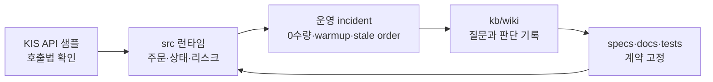

`open-trading-api`를 붙잡고 자동매매 봇을 만들면서 처음 기대한 배움은 전략 쪽에 가까웠습니다. 어떤 진입 신호가 더 나은지, 장초반 돌파와 5분 추세 전략을 어떻게 섞을지, 백테스트와 실거래를 어디까지 맞출 수 있을지가 궁금했어요. 그런데 로컬 위키에 쌓인 incident를 다시 읽어 보니, 실제로 저를 많이 바꾼 건 전략 공식이 아니었습니다. 실시간 시장에서는 `시간`, `데이터`, `주문`, `로컬 상태`의 경계가 조금만 흐려져도 봇이 자기 판단을 설명하지 못한다는 사실이 더 크게 남았습니다.

이 글은 그래서 기능 소개보다 회고에 가깝습니다. 한국투자증권 Open API 샘플 저장소를 바탕으로 `src/` 런타임, 장전 scanner, active watchlist, 전략, 위키, 스펙, 테스트를 붙이며 제가 무엇을 배웠고 무엇을 느꼈는지 정리해 보려 해요.

**이번 글에서 볼 것**

- 자동매매 개발의 어려움은 전략보다 `시간`, `데이터`, `주문`, `상태`의 경계에서 더 자주 드러났어요.
- 실거래 봇에서는 "주문하지 않음", fail-closed, reconcile, degraded mode가 보조 기능이 아니라 핵심 기능이 됩니다.
- 가장 크게 남은 감각은 자신감보다 겸손이었고, 그 불안을 낮춰 준 것은 로그, 테스트, 위키였습니다.

## 샘플에서 계좌로 넘어가며 기준이 바뀌었어요

처음 출발점은 API 샘플 코드였습니다. 샘플은 인증을 하고, 시세를 읽고, 주문을 넣는 방법을 보여 줍니다. 하지만 실거래 봇은 그다음 질문을 피할 수 없어요. 주문이 실제로 체결됐는지, 로컬 DB에는 어떤 상태로 남았는지, 재기동하면 무엇을 믿어야 하는지, 오늘 장에서 이 전략이 아직 같은 포지션을 소유하고 있는지까지 계속 기억해야 합니다.

그래서 `open-trading-api`의 로컬 개발은 단순 호출 예제에서 `src/` 기반 런타임으로 커졌습니다. 인증, quote, intraday bar, 잔고, 현금 주문, SQLite 주문/시그널/상태 저장, daemon loop, kill switch, startup reconciliation이 한 흐름 안에 들어왔어요. 이때부터 코드는 "API가 된다"보다 "실패한 뒤에도 설명 가능하다"를 목표로 바뀌었습니다.

이 개발에서 반복된 흐름은 기능을 붙이는 선형 진행보다, 운영 중 드러난 불일치를 위키와 테스트로 다시 런타임 계약에 넣는 순환에 가까웠어요.

이 순환을 겪으며 느낀 건, 예제 코드는 성공 경로를 설명하지만 봇은 실패 경로를 기억해야 한다는 점이었습니다. 특히 실계좌와 닿는 코드는 예쁘게 동작하는 한 번보다, 애매한 상태에서 멈추거나 되돌아설 수 있는 능력이 더 중요했습니다.

## 전략보다 먼저 시장의 시계를 배웠어요

처음에는 `opening_range_breakout_1m`와 `sma_cross_5m`를 어떻게 조합할지가 큰 질문처럼 보였습니다. 장초반에는 시가 구간 돌파 전략 (Opening Range Breakout, ORB)을 쓰고, 이후에는 5분 이동평균 교차 전략인 `sma_cross_5m`로 넘어가면 깔끔해 보였거든요. 하지만 실제로 어려웠던 건 "어떤 전략이 더 좋은가"보다 "지금 이 포지션을 누가 소유하고 있는가"였습니다.

현재 `opening_range_breakout_1m`는 이름과 달리 기본 동작이 5분 ORB에 가깝습니다. 첫 유효 돌파 평가는 보통 `09:10` completed bar부터 가능하고, ORB 포지션이 열려 있으면 `09:30` 이후에도 ORB가 자기 stop, VWAP 이탈, time stop, session close 청산을 계속 관리합니다. `sma_cross_5m`는 포트폴리오가 flat이 된 뒤 신규 진입을 맡는 쪽이 더 안전했어요.

2026-04-10 ORB 세션 경계 incident는 이 감각을 강하게 남겼습니다. `history_scope=session`인데도 로그의 `first_ts`, `last_ts`가 전일 `15:20`, `15:25`를 가리켰고, 당일 opening range가 아니라 전일 tail bar로 5분봉이 만들어질 수 있었습니다. 문제는 전략 아이디어가 아니라 same-day current-session cache와 scheduler session replay가 당일 세션을 끝까지 보존하지 못한 데 있었어요.

| 처음 기대한 질문 | 실제로 더 중요했던 질문 |
| --- | --- |
| ORB와 SMA 중 무엇이 더 좋은가 | ORB 포지션이 남았을 때 청산 소유권은 누구에게 있는가 |
| 09:15 이후 자동 전환하면 되는가 | non-flat 상태에서 전략 전환을 보류할 것인가 |
| 5분봉이 충분히 있는가 | 그 5분봉이 당일 세션에서 온 것인가 |
| 진입 신호가 나왔는가 | 같은 신호를 주문으로 바꿔도 되는 시장 상태인가 |

이때 배운 건 시장의 시계가 전략보다 앞에 있다는 점입니다. `09:00`, `09:10`, `09:30`, 정규장, 이전 정규장 tail, current-session cache 같은 경계를 먼저 고정하지 않으면, 같은 전략도 전혀 다른 의미의 데이터를 보고 판단하게 됩니다.

## 데이터는 빈칸을 품은 채로 왔어요

자동매매를 만들기 전에는 1분봉을 요청하면 정규장 전체가 촘촘한 시계열로 올 거라고 막연히 생각했습니다. 실제로는 그렇지 않았어요. KIS intraday 데이터는 종목마다 밀도가 달랐고, 어떤 종목은 거래가 있었던 분만 1분봉으로 내려오는 것처럼 관측됐습니다. 그래서 `raw_bars=147`이어도 5분 집계 뒤에는 `bars=19`처럼 줄어들 수 있었습니다.

이 문제는 `sma_cross_5m` warmup incident에서 반복해서 드러났습니다. 전략은 SMA, ADX, ATR 필터를 계산하려면 completed 5분봉이 충분히 필요합니다. 그런데 기존 집계는 같은 5분 버킷 안에 1분봉 5개가 모두 있어야 completed bar로 봤기 때문에, 중간에 거래가 없던 분이 많으면 raw 1분봉은 많아도 5분봉은 부족해졌어요.

나중에 이 문제는 `0-volume clock minute` 보정으로 정리됐습니다. 같은 세션 날짜 안에서 비어 있는 분을 직전 체결가와 volume 0으로 채우고, 5분봉을 "거래가 있던 분 5개"가 아니라 "시장 시계 기준으로 닫히는 구간"으로 해석한 겁니다. 이 결정은 단순 전처리가 아니라 전략 의미를 다시 정한 일이었습니다.

**여기서 배운 데이터 감각**

- 브로커가 주는 원시 데이터는 제가 기대한 분석용 테이블과 다를 수 있어요.
- 빈 1분봉은 통신 실패가 아니라 그 분에 체결이 없었다는 시장 현실일 수 있어요.
- 집계 규칙은 성능 최적화가 아니라 전략이 보는 세계를 정의하는 계약이에요.

이 경험 뒤로는 "데이터가 부족하다"는 말을 더 조심해서 쓰게 됐습니다. 부족한 게 API 호출인지, 이전 정규장 fallback인지, sparse intraday인지, 아니면 집계 의미인지 나눠야 했어요. 로그에 `raw_bars`, `aggregated_bars`, `gap_count_over_one_minute`, `future_filtered` 같은 값을 남기기 시작한 이유도 여기에 있습니다.

## 주문하지 않는 판단도 기능이어야 했어요

2026-04-06의 0수량 주문 incident는 작지만 기억에 오래 남습니다. 당시 로컬 상태를 재구성해 보니 계좌 equity와 cash는 `5,340원`, limit price는 `3,620원`, `risk.max_position_pct=0.20`이었습니다. 최종 주문 원금 한도는 `1,068원`이라서 1주도 살 수 없었어요. 브로커 응답이 완전히 0은 아니어서 리스크 엔진은 지나갔지만, 주문 수량 계산에서는 `floor(1068 / 3620) = 0`이 된 겁니다.

이건 시스템 오류라기보다 정상적인 차단이었습니다. 그래서 `ZeroQuantityOrderError`를 따로 두고, scheduler가 이를 `decision=blocked`와 warning으로 기록하게 했습니다. 그 뒤로 "주문이 나가지 않았다"는 결과를 실패로만 보지 않게 됐어요. 자동매매에서 가장 필요한 기능 중 하나는 위험한 순간에 아무것도 하지 않는 능력이었습니다.

같은 계열의 판단은 여러 곳에서 반복됐습니다. RVOL at Time baseline 표본이 부족하면 `rvol_baseline_missing`으로 진입을 막아야 했고, 장전 scanner는 cutoff까지 핵심 데이터가 비어 있으면 fail-closed로 돌아서야 했습니다. ORB false breakout kill switch도 기회를 포기하는 대신 같은 장에서 더 큰 실수를 막는 장치였어요.

이 부분에서 느낀 감정은 꽤 현실적이었습니다. 자동매매 코드는 뭔가를 잘 찾아서 주문하는 프로그램처럼 보이지만, 막상 계좌와 닿으면 "왜 사지 않았는지"를 설명하는 코드가 더 마음을 편하게 합니다. 주문하지 않는 결정을 상태와 테스트로 남길 수 있어야 다음 날 같은 경고를 보고도 당황하지 않습니다.

## 상태 복구는 장 시작 전에만 끝나지 않았어요

실거래 봇에서 가장 불편하게 남은 단어 중 하나는 reconciliation이었습니다. 처음에는 재기동할 때 한 번만 브로커 잔고와 로컬 DB를 맞추면 된다고 생각했습니다. 하지만 장중에도 로컬 truth와 브로커 truth는 계속 어긋날 수 있었어요.

대표적인 사례가 2026-04-13의 stale open order incident입니다. `sma_cross_5m`가 보유 종목에 대해 `session_vwap_lost`, `atr_stop_hit` 같은 청산 시그널을 냈는데, 주문 제출 직전 `open order already exists for symbol`로 계속 막혔습니다. 실제 원인은 SELL 미체결이 아니라 로컬 DB에 기존 BUY 주문이 stale `ACCEPTED` 상태로 남아 있던 것이었어요. 브로커에는 이미 보유 `2주`가 있었고 미체결 주문은 없었습니다.

이 상태에서는 리스크 엔진이 "열린 주문이 있다"고 보고 청산을 막습니다. 전략은 팔아야 한다고 말하고, 브로커 상태도 팔 수 있는데, 로컬 상태 하나가 청산을 막은 셈입니다. 그래서 startup-only reconciliation을 cycle 시작에서도 재사용하도록 바꿨고, 로컬에 열린 주문이 있을 때만 브로커 open orders를 추가 조회해 비용과 안전을 같이 관리했습니다.

여기서 배운 건 복구 로직이 예외 처리 주변부가 아니라 도메인 로직이라는 점입니다. 자동매매의 상태는 DB 한 곳에 고정돼 있지 않습니다. 브로커 잔고, 미체결 주문, 로컬 주문 테이블, 전략 runtime state가 서로 다른 속도로 갱신됩니다. 봇은 이 차이를 없앨 수는 없고, 매 cycle마다 어느 쪽을 더 신뢰할지 보수적으로 정해야 합니다.

## 성능 목표는 유니버스 크기와 함께 써야 했어요

성능에서도 비슷한 배움이 있었습니다. 2026-04-09 live daemon 로그에서는 `sma_cross_5m` 선조회 단계만 약 `84초`, 전체 cycle은 약 `88초`가 걸렸습니다. 당시 경로는 100종목 full `config_universe`, REST-only, full-session replay였습니다. `11:05` 시점 raw 1분봉 limit이 `148`개였고, 당일분봉조회가 한 번에 대략 30건씩 내려오니 종목당 약 5회 호출, 100종목이면 대략 500 calls/cycle이 됩니다.

처음에는 worker 수를 늘리면 해결될 것처럼 보일 수 있습니다. 하지만 실제 병목은 단순 thread 수보다 구조였습니다. 장중 내내 `09:00~now`를 다시 재생하고, same-day intraday를 사이클마다 긁고, 연결 재사용도 부족하면 병렬화만으로는 한계가 분명합니다. 이후 `requests.Session` 기반 connection reuse, current-session cache, request budget 로그, degraded mode 경고가 들어간 이유가 여기에 있어요.

이 경험 뒤에는 `1초`라는 말을 혼자 쓰지 않게 됐습니다. `1초` 목표는 active watchlist나 live scanner가 줄인 selected universe 경로에만 붙어야 합니다. 100종목 full `config_universe` fallback은 동작할 수는 있어도 정상 저지연 경로가 아니라 degraded mode로 분리해야 했습니다.

**성능 목표를 쓸 때 같이 써야 하는 조건**

- 몇 종목을 평가하는가
- 같은 cycle에서 REST 호출이 몇 번 나가는가
- current-session cache가 warm 상태인가
- selected universe인가, full `config_universe` fallback인가

이건 성능 최적화의 교훈이기도 하지만, 문서화의 교훈이기도 했습니다. 목표 숫자만 남기면 나중에 스스로도 그 숫자를 잘못 이해합니다. 어떤 경로의 약속인지, 어떤 경로는 경고로 봐야 하는지를 함께 남겨야 했어요.

## 위키와 테스트가 감정을 낮춰 줬어요

이 개발에서 가장 좋았던 습관은 incident를 채팅에서 끝내지 않고 `kb/wiki/queries/`에 남긴 것입니다. 0수량 주문, SMA warmup, sparse intraday, ORB 세션 경계, RVOL baseline cold-start, stale open order가 각각 독립 문서로 정리됐고, 각 문서는 코드 경로와 테스트 경로를 같이 가리켰습니다. 덕분에 다음 문제를 만났을 때 "전에 비슷한 일이 있었는데"에서 끝나지 않고 바로 비교할 수 있었습니다.

테스트도 단순히 통과 여부를 확인하는 장치보다, 운영 판단을 고정하는 문서에 가까웠습니다. 예를 들어 0수량 주문은 partial error가 아니라 warning이어야 했고, ORB session replay는 전일 tail을 섞지 않아야 했고, stale BUY 주문이 남아 있어도 cycle-start reconcile 뒤 SELL 청산이 제출돼야 했습니다. 이런 문장을 테스트로 고정해 두니, 무서운 코드를 조금 덜 무섭게 고칠 수 있었습니다.

개인적으로 가장 크게 느낀 건 자신감보다 겸손입니다. 시장 데이터는 비어 있을 수 있고, 브로커 응답은 생각보다 다른 형식으로 올 수 있고, 로컬 DB는 실제 계좌보다 늦을 수 있고, 로그 한 줄의 포맷 오류도 다음 분석을 막을 수 있습니다. 자동매매 봇은 이 모든 어긋남을 없애는 프로그램이 아니라, 어긋남이 생겼을 때 무엇을 믿고 어디서 멈출지 설명하는 프로그램에 가까웠습니다.

## 마무리

`open-trading-api`를 만들며 배운 건 더 복잡한 전략을 붙이는 법보다, 작은 경계를 문서와 코드에 계속 고정하는 법이었습니다. 시간 경계, 데이터 집계 의미, 주문 차단 이유, 브로커와 로컬 상태의 reconciliation, selected universe와 degraded mode의 구분이 모두 전략만큼 중요했습니다.

다음에 이 시스템을 다시 손본다면 먼저 보고 싶은 것도 수익률 그래프 하나가 아닙니다. 장중 미체결 정정/취소 루프, WebSocket 또는 local bar cache, scanner postmortem metric처럼 아직 닫히지 않은 운영 경계가 먼저 보입니다. 자동매매 개발은 결국 "어떻게 더 많이 맞힐까"와 함께 "틀리거나 모를 때 어떻게 멈출까"를 계속 묻는 일이라는 생각이 남았습니다.
