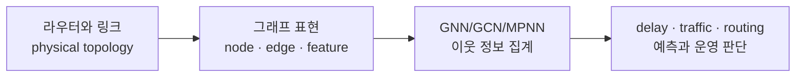

Weiwei Jiang의 `Graph-based Deep Learning for Communication Networks: A Survey`를 읽으면서 가장 먼저 잡아야 할 문장은 이것이었어요. 통신망에서 그래프 신경망 (Graph Neural Network, GNN)은 그냥 모델 이름 하나를 더 붙이는 일이 아니라, 라우터와 링크와 트래픽이 얽힌 구조를 입력의 중심에 다시 놓는 방식입니다.<a href="#src-1">[1]</a> 그래서 이 논문은 GNN 모델 목록보다 "통신망 문제를 어떤 그래프로 바꿀 수 있는가"를 보는 편이 더 잘 읽힙니다.

이번 글에서는 논문의 전체 요약을 먼저 잡고, 그다음 유선 네트워크에서 GNN이 어디에 쓰이는지 정리합니다. 마지막에는 제가 따로 Q&A로 정리했던 GNN 일반식과 그래프 합성곱 네트워크 (Graph Convolutional Network, GCN) 수식의 연결을 풀어보려 해요.

**이번 글에서 볼 것**

- 논문의 핵심은 통신망의 topology, routing, traffic을 GNN 입력 구조로 되살리는 데 있어요.
- 유선 네트워크에서는 network modeling, configuration, prediction, routing, security가 주요 활용 축으로 묶입니다.
- GCN 수식은 어렵게 보면 행렬 곱이지만, 쉽게 보면 "이웃과 섞고, feature를 바꾸는" 메시지 패싱의 특수한 형태예요.

## 0. 논문은 통신망을 그래프로 다시 읽습니다

이 서베이는 2016년부터 2021년까지의 관련 연구 81편을 무선 네트워크, 유선 네트워크, 소프트웨어 정의 네트워킹 (Software Defined Networking, SDN) 세 시나리오로 나눠 정리합니다.<a href="#src-1">[1]</a> 논문이 보는 통신망의 문제는 routing, load balancing, traffic prediction, resource allocation, virtual network embedding처럼 오래된 문제와 새 문제가 섞여 있습니다. 기존 딥러닝 모델도 이런 문제에 쓰였지만, 많은 모델은 이미지나 시계열처럼 유클리드 구조의 데이터에 더 자연스럽게 맞춰져 있었어요.<a href="#src-1">[1]</a>

GNN이 들어오는 이유는 여기에 있습니다. 통신망은 처음부터 그래프에 가깝습니다. 유선 backbone에서는 node가 router이고, edge가 physical transmission link입니다. node feature에는 in-flow와 out-flow traffic이 들어갈 수 있고, edge feature에는 bandwidth나 delay 같은 transmission metric이 들어갈 수 있어요.<a href="#src-1">[1]</a> 즉 모델이 배워야 하는 것은 노드 하나의 값만이 아니라, 노드와 링크와 경로가 함께 만드는 관계입니다.

이 논문을 읽을 때 중요한 흐름은 통신망을 표나 시계열로만 보지 않고, topology를 가진 그래프로 바꾼 뒤 예측과 최적화로 연결하는 점이에요.

논문은 GNN을 만능 도구처럼 쓰지는 않습니다. 공개 학습 데이터가 부족하고, 깊은 GCN에서는 over-smoothing 문제가 생기며, link failure나 congestion 같은 perturbation 상황에서 안정성을 따로 봐야 한다고 지적합니다.<a href="#src-1">[1]</a> 그래서 이 글에서도 "GNN을 쓰면 된다"보다 "어떤 네트워크 문제를 어떤 그래프로 만들 수 있나"에 초점을 두는 편이 맞습니다.

## 1. 유선망에서는 예측이 운영으로 이어집니다

유선 네트워크 섹션에서 논문은 computer network를 중심으로 network modeling, network configuration, network prediction, network management, network security를 나눠 설명합니다.<a href="#src-1">[1]</a> 여기에 blockchain platform, data center network, optical network 같은 특수한 유선망 사례가 이어져요. 읽으면서 저는 이 섹션을 "예측 모델을 만든다"보다 "예측을 운영 판단으로 넘긴다"는 흐름으로 보는 편이 더 자연스러웠습니다.

| 활용 축 | 입력으로 보는 것 | GNN이 돕는 판단 |
| --- | --- | --- |
| Network modeling | topology, routing scheme, traffic matrix | delay, jitter, loss, throughput 같은 end-to-end metric 추정 |
| Configuration | 부분 설정과 네트워크 구조 | BGP configuration synthesis, MPLS property analysis, feasibility 판단 |
| Prediction | traffic history와 그래프 구조 | delay prediction, origin-destination traffic prediction, backbone traffic prediction |
| Management | 예측된 네트워크 상태 | routing optimization, load balancing, traffic engineering |
| Security | botnet connection, intrusion alert graph | botnet pattern detection, alert correlation |

Network modeling은 가장 기본 축입니다. 논문은 topology, routing scheme, traffic matrix를 입력으로 두고 end-to-end metric을 추정하는 연구들을 묶습니다.<a href="#src-1">[1]</a> 여기서 중요한 점은 "그래프를 예쁘게 embedding한다"가 아니라, 운영자가 아직 보지 못한 topology나 traffic 조합에 대해 delay, jitter, loss 같은 값을 추정하려 한다는 데 있어요.

Prediction 축도 비슷합니다. 예를 들어 SGCRN은 그래프 합성곱과 GRU를 결합해 실제 IP backbone traffic data에서 traffic prediction을 다룹니다.<a href="#src-1">[1]</a> MSTNN은 origin-destination traffic prediction을 다루고, DCRNN에서 영감을 받은 모델도 network traffic prediction에 쓰입니다.<a href="#src-1">[1]</a> 결국 GNN은 topology 방향의 공간 의존성을 잡고, GRU나 recurrent 구조는 시간 방향 변화를 잡는 식으로 역할이 나뉩니다.

**유선망에서 눈에 남는 번역**

- GNN은 "라우터를 node로, 링크를 edge로 둔 뒤 traffic과 delay를 feature로 넣는 모델"로 출발합니다.
- 이 모델이 쓸모 있으려면 예측에서 끝나지 않고 routing, load balancing, configuration change 같은 운영 판단으로 이어져야 합니다.

Data center network와 optical network는 이 관점을 더 분명하게 보여 줍니다. 데이터센터에서는 topology가 바뀌어도 Flow Completion Time (FCT)을 예측하고, 그 결과를 flow routing, flow scheduling, topology management에 쓰려는 연구가 소개됩니다.<a href="#src-1">[1]</a> Optical Transport Network (OTN)에서는 GNN의 일반화 능력과 deep reinforcement learning을 결합해 unseen topology에서 routing을 최적화하는 흐름도 나옵니다.<a href="#src-1">[1]</a>

그래서 유선망에서 GNN을 읽을 때는 모델 이름보다 질문을 먼저 적는 편이 좋습니다. "이 그래프에서 node와 edge는 무엇인가", "예측하려는 값은 delay인가 traffic인가 routing cost인가", "그 예측이 어떤 운영 행동으로 이어지는가"를 보면 각 연구의 위치가 잡힙니다.

## 2. GNN에서 GCN으로 가는 길은 메시지 함수를 고르는 일입니다

제가 따로 정리한 Q&A에서 가장 크게 막혔던 지점은 "GNN의 한 종류가 GCN이라면, 일반식이 어떻게 GCN 식으로 이어지나"였어요. 논문은 Message Passing Neural Network (MPNN)를 소개하면서 메시지 패싱을 아래처럼 씁니다.<a href="#src-1">[1]</a>

$$
m_i^{(t)}=\sum_{j\in N(i)} M^{(t)}(X_i^{(t-1)},X_j^{(t-1)},e_{ij})
$$

$$
X_i^{(t)}=U^{(t)}(X_i^{(t-1)},m_i^{(t)})
$$

첫 번째 식은 이웃에게서 메시지를 모으는 단계이고, 두 번째 식은 그 메시지로 내 상태를 업데이트하는 단계입니다. GCN은 이 일반 틀에서 메시지 함수와 업데이트 함수를 비교적 단순하게 고른 경우로 볼 수 있어요. 이웃 node의 feature를 가져오고, adjacency로 이웃을 모은 뒤, learnable weight와 activation을 통과시키는 식입니다.

GCN에서는 보통 self-loop를 넣습니다. 자기 자신도 이웃 집계에 포함하기 위해 adjacency에 identity matrix를 더하는 거예요.

$$
\tilde{A}=A+I_N
$$

그다음 degree normalization으로 이웃이 많은 node의 값이 단순 합 때문에 커지는 문제를 줄입니다.

$$
\hat{A}=\tilde{D}^{-1/2}\tilde{A}\tilde{D}^{-1/2}
$$

이제 node feature를 행으로 쌓은 \(H^{(l)}\)를 쓰면 GCN은 흔히 아래처럼 읽을 수 있습니다.

$$
H^{(l+1)}=\sigma(\hat{A}H^{(l)}W^{(l)})
$$

이 식을 한 문장으로 줄이면 "이웃과 섞고, feature를 바꾼다"입니다. \(\hat{A}H^{(l)}\)가 graph topology를 따라 이웃 feature를 aggregation하는 부분이고, \(W^{(l)}\)가 feature 차원을 바꾸는 선형변환입니다. 여기에 \(\sigma\)가 비선형성을 더합니다.

## 3. W가 뒤에 있는 이유는 행렬의 방향 때문입니다

두 번째로 헷갈렸던 질문은 "선형변환이면 \(Wx\) 아닌가, 왜 GCN 식에서는 \(HW\)인가"였습니다. 결론은 convention 차이예요. 선형대수 교재에서는 feature vector를 열벡터로 두는 경우가 많아서 \(Wx\)가 자연스럽습니다. 하지만 GCN 구현과 논문 설명에서는 전체 node feature를 행렬로 쌓고, 한 행을 한 node의 feature로 보는 표기가 자주 나옵니다.

$$
H^{(l)} \in \mathbb{R}^{N \times d}, \qquad W^{(l)} \in \mathbb{R}^{d \times d'}
$$

이때 \(H^{(l)}W^{(l)}\)는 \(N \times d'\)가 됩니다. node 개수 \(N\)은 유지되고, feature 차원만 \(d\)에서 \(d'\)로 바뀌는 거죠. 반대로 이 표기에서 \(W^{(l)}H^{(l)}\)를 그대로 쓰면 일반적으로 차원이 맞지 않습니다.

| 곱 | 작용하는 축 | 의미 |
| --- | --- | --- |
| \(\hat{A}H\) | node 축 | graph topology를 따라 이웃 node 정보를 섞음 |
| \(HW\) | feature 축 | 각 node의 feature vector를 새 표현 공간으로 변환 |
| \(\hat{A}HW\) | node 축 다음 feature 축 | 이웃 집계와 feature 변환을 함께 수행 |

이 표를 놓고 보면 \(HWA\)가 왜 이상한지도 보입니다. adjacency는 node-to-node 관계를 담는 행렬이므로 node 축에 작용해야 합니다. feature 변환 뒤에 adjacency를 오른쪽에서 붙이면 feature 축 뒤에 node 관계를 억지로 붙이는 모양이 되고, 보통은 차원도 의미도 맞지 않아요.

**수식에서 놓치기 쉬운 점**

- \((\hat{A}H)W\)와 \(\hat{A}(HW)\)는 차원이 맞으면 행렬 곱의 결합법칙 때문에 같은 결과가 됩니다.
- 하지만 \(HWA\)는 adjacency가 작용해야 할 축이 달라지므로 GCN의 이웃 aggregation으로 읽기 어렵습니다.

## 4. 운영 모델로 쓰려면 한계도 같이 봐야 합니다

논문이 좋았던 점은 GNN을 좋은 말로만 끝내지 않는다는 데 있습니다. 첫 번째 한계는 데이터입니다. 이미지 분야의 ImageNet 같은 대규모 공개 benchmark에 비해, 통신망 GNN을 학습할 공개 데이터는 부족하고 규모도 실제 운영망에 비해 작다고 봅니다.<a href="#src-1">[1]</a>

두 번째 한계는 GNN depth입니다. 논문은 GCN layer가 많아질수록 node 표현이 지나치게 비슷해지는 over-smoothing 문제를 지적합니다.<a href="#src-1">[1]</a> 통신망에서는 node별 역할이 라우터 위치, 링크 용량, traffic pattern에 따라 달라질 수 있는데, 모든 node 표현이 비슷해지면 오히려 운영 판단에 필요한 차이가 사라질 수 있습니다.

세 번째는 안정성과 설명가능성입니다. 통신망에서는 link failure, congestion, targeted attack 같은 상황이 실제로 생깁니다. 논문은 이런 stochastic perturbation과 adversarial attack 아래에서 GNN 안정성을 따로 봐야 한다고 말합니다.<a href="#src-1">[1]</a> 또 routing이나 resource allocation에 모델 예측을 연결하려면, 왜 그런 판단이 나왔는지 운영자가 추적할 수 있어야 합니다.

마지막으로 규모 문제가 남습니다. Future directions에서 논문은 많은 연구가 100개 미만 node 수준의 작은 topology를 다룬다고 지적합니다.<a href="#src-1">[1]</a> 실제 backbone이나 대규모 데이터센터에 적용하려면 graph partitioning, parallel computing, 성능 향상 폭과 계산 비용의 trade-off를 같이 봐야 합니다.

## 마무리

이 논문을 읽고 나면 GNN은 "통신망에 딥러닝을 붙였다"보다 "통신망이 원래 갖고 있던 그래프 구조를 모델이 읽게 했다"는 쪽에 더 가깝게 보입니다. 특히 유선 네트워크에서는 topology와 traffic을 함께 읽어 delay, routing, configuration, security 판단으로 연결하는 흐름이 중요해요.

제가 Q&A로 정리한 GCN 수식도 같은 관점에서 풀립니다. \(\hat{A}H\)는 이웃과 섞는 일이고, \(W\)는 feature를 바꾸는 일입니다. 다음에 이 주제를 더 이어간다면, RouteNet이나 SGCRN처럼 유선망에서 실제로 delay와 traffic을 예측하는 모델 하나를 잡고 "그래프 입력이 운영 판단으로 어떻게 넘어가는가"를 더 구체적으로 보는 편이 좋겠습니다.

## 출처

[1] Weiwei Jiang, Graph-based Deep Learning for Communication Networks: A Survey, Computer Communications, 2022, <a href="https://doi.org/10.1016/j.comcom.2021.12.015" target="_blank" rel="noopener noreferrer">[원문보기]</a>
