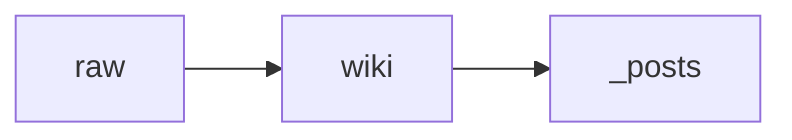

# 블로그 엔지니어링 가이드

## 문서 목적

이 문서는 기술 글의 문장력과 별개로, 화면에서 얼마나 덜 피곤하게 읽히는지를 관리하는 기준을 정한다. 목표는 더 화려한 페이지를 만드는 것이 아니라, 긴 글도 스캔 경로와 시각적 멈춤점이 분명한 게시 형식으로 만드는 것이다.

## 역할 분리

- `docs/technical-post-writing-guide.md`는 논지, 문체, 소제목, 근거 표기 같은 "글쓰기 규약"을 맡는다.
- 이 문서는 요약 박스, 본문 폭, 시각 요소, 표와 그림, 강조 방식 같은 "게시 형식 규약"을 맡는다.
- 두 문서는 함께 적용한다. 좋은 기술 글이라도 화면 리듬이 단조로우면 읽는 피로도가 빠르게 올라간다.

## 적용 범위

- `_posts/`의 공개 기술 글
- `wiki/drafts/`의 발행 후보 초안
- 논문 해설, 아키텍처 글, 운영 회고, 도구 비교처럼 4개 이상 섹션으로 이어지는 긴 글

짧은 공지나 노트형 글은 일부 규칙을 완화할 수 있지만, 아래 원칙은 가능한 한 유지한다.

## 기본 원칙

### 1. 글쓰기와 화면 밀도는 따로 설계한다

- 문장이 좋더라도 긴 단락이 같은 간격으로 반복되면 화면이 빽빽해 보인다.
- 본문 내용과 별개로 `요약`, `탐색`, `강조`, `시각 전환`을 위한 컴포넌트를 둔다.

### 2. 독자에게 먼저 스캔 경로를 준다

- 긴 글은 상단에서 "이 글에서 무엇을 볼지"를 먼저 알려 준다.
- 독자가 본문을 순서대로 다 읽지 않아도 구조를 빠르게 파악할 수 있어야 한다.

### 3. 강조는 문장 내부보다 블록 단위로 처리한다

- 볼드체는 용어 정의나 섹션 첫 판단 문장 정도로 제한한다.
- 반복 가능한 강조는 `notice`, `표`, `figure caption`, `요약 리스트`로 처리한다.

### 4. 서술만 세 섹션 이상 연속으로 이어 가지 않는다

- 긴 글은 2~3개 섹션마다 최소 한 번 시각적 전환을 둔다.
- 시각적 전환은 그림, 다이어그램, 표, 짧은 체크리스트, 코드 발췌 중 하나면 충분하다.

## 기본 컴포넌트 규약

### 1. 요약 박스

- 본문 섹션이 4개 이상이거나 읽기 시간이 긴 글은 서론 다음에 요약 박스를 둔다.
- 이름은 `이번 글에서 볼 것`, `세 줄 요약`, `먼저 결론` 중 하나로 고정한다.
- 항목 수는 2~4개를 권장한다.

예시:

```html
<div class="notice--primary" markdown="1">

**이번 글에서 볼 것**

- 이 글의 중심 판단
- 독자가 먼저 봐야 할 구조
- 마지막까지 읽지 않아도 가져갈 수 있는 결론

</div>
```

### 2. 목차와 본문 폭

- `toc: true`는 긴 글에서 기본값으로 유지한다.
- 본문이 해설형이고 긴 단락 비중이 크면 `classes: [reading-post]`를 사용해 읽기 폭을 줄인다.
- 넓은 표, 큰 그림, 코드 비교가 글의 중심일 때만 `wide`를 유지한다.

### 3. 시각적 멈춤점

- 2~3개 섹션마다 최소 한 번은 아래 요소 중 하나를 둔다.
- 그림 또는 다이어그램
- 비교 표
- 짧은 bullet summary
- note / warning / checkpoint 박스
- 20줄 안팎의 코드 발췌

### 4. 강조 방식

- 한 문단에서 굵게 처리하는 문장은 1개 이내를 권장한다.
- 여러 문장을 연속으로 굵게 처리하지 않는다.
- 중요 포인트는 `notice--primary`, 보충 설명은 `notice--info`, 주의사항은 `notice--warning`을 우선 사용한다.

### 5. 그림과 캡션

- 외부 그림, 원문 Figure, 직접 그린 다이어그램 중 무엇이든 가능하지만 캡션은 반드시 붙인다.
- 캡션은 "이 그림에서 무엇을 봐야 하는가"를 한 문장으로 적는다.
- 외부 그림이면 본문 또는 캡션에서 출처를 드러낸다.
- 논문 리뷰와 아키텍처 글은 가능하면 최소 1개 그림과 1개 표를 포함한다.

예시:

````markdown


<p class="figure-caption">이 글에서 중요한 건 디렉터리 이름보다, 원문과 해석과 공개 결과를 서로 다른 층에 둔다는 점이에요.</p>
````

### 6. 섹션 리듬

- 모든 섹션을 같은 길이로 맞추지 않는다.
- 서술형 섹션 사이에 표나 리스트를 끼워 리듬을 바꾼다.
- 각 섹션 첫 문장은 가능하면 짧고 단단한 판단 문장으로 시작한다.

## 이 저장소에서 쓰는 구현 규약

### 1. 기본 기능

- [`_config.yml`](/Users/shimhy97/shimhy97-github.io/_config.yml)에는 `toc`, `toc_sticky`, `read_time`, `related`가 기본 켜져 있다.
- Mermaid와 MathJax가 이미 활성화되어 있으므로, 시각 요소와 수식을 추가로 도입할 수 있다.

### 2. 읽기 폭 제어

- 긴 해설 글은 front matter에 아래 클래스를 추가한다.

```yaml
classes:
  - reading-post
```

- `reading-post`는 본문 폭을 줄이고, 요약 박스·표·코드·그림이 한 덩어리씩 분명하게 보이도록 보정하는 클래스다.

### 3. notice 사용

- 이 저장소는 Minimal Mistakes의 notice 스타일을 사용한다.
- notice는 HTML 블록에 `markdown="1"`을 붙이는 방식으로 작성한다.

```html
<div class="notice--info" markdown="1">

**헷갈리기 쉬운 점**

- 이 기능은 검색이 아니라 위키 유지보수에 더 가깝다.

</div>
```

### 4. 캡션과 보조 스타일

- 그림 캡션은 `<p class="figure-caption">...</p>` 형식을 사용한다.
- 강조 박스와 캡션 스타일의 실제 색상과 여백은 [`assets/css/main.scss`](/Users/shimhy97/shimhy97-github.io/assets/css/main.scss)에서 관리한다.

## 글 종류별 최소 권장안

### 논문 리뷰

- 요약 박스 1개
- 원문 Figure 또는 재구성 다이어그램 1개 이상
- 핵심 비교 표 1개 이상
- 수식이 길면 블록 수식으로 분리

### 아키텍처 / 구현기

- 요약 박스 1개
- 흐름도 또는 계층도 1개 이상
- 운영 체크리스트 또는 비교 표 1개

### 운영 회고

- 요약 박스 1개
- 타임라인, incident 표, 체크리스트 중 1개 이상

## 발행 전 체크리스트

- 요약 박스가 있는가
- 세 개 이상의 긴 서술 섹션이 연속으로 붙어 있지 않은가
- 그림이나 표에 캡션이 붙어 있는가
- 볼드체가 문장 전체를 계속 덮고 있지 않은가
- 본문 폭이 긴 글에 맞게 조절되어 있는가
- 목차만 보고도 글의 구조가 읽히는가

## 운영 원칙으로 요약하면

기술 블로그의 가독성은 문장만으로 결정되지 않는다. 긴 글이 잘 읽히는 이유는 글을 잘 써서가 아니라, 독자가 쉬어 갈 위치와 먼저 볼 위치를 화면 위에 설계해 두기 때문이다.
